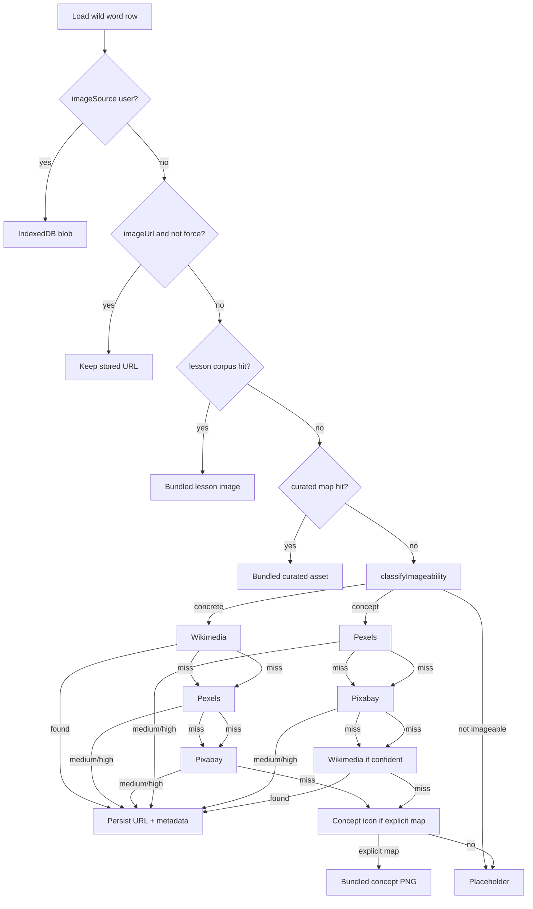

# My Words — automatic image pipeline

Display-only enrichment for saved wild words. Images must help encode the word and meaning. If no safe licensed image is found, the UI keeps a placeholder rather than showing a misleading picture.

**Official image APIs only** — no random web scraping, Google Images, or unlicensed hotlinks to arbitrary sites.

## Source precedence (runtime)

1. **User upload** (`imageSource: "user"`) — always wins; never overwritten by automation.
2. **Existing `imageUrl`** — kept on enrich unless `force` refresh (still never overwrites user blobs).
3. **Lesson corpus** (`imageSource: "lesson"`) — `lexemeKey` / language + normalized text → bundled chunk assets.
4. **Curated static map** (`imageSource: "curated"`) — `lib/wild-word-curated-images.ts` (concrete nouns only when clearly good).
5. **External image search** (`imageSource: `"wikimedia"` | `"pexels"` | `"pixabay"`) — `POST /api/image-search` (server-side).
6. **Local concept icon** (`imageSource: "concept"`) — explicit phrase map only, **fallback** after external search fails.
7. **Placeholder** — no image URL.



- Runs in **`enrichWildWordRecord`** (My Words enrich / refresh), not on every card render.
- Client calls **`/api/image-search`**; API keys never go to the browser.

## Imageability (`lib/imageability.ts`)

Before any external lookup, terms are classified. Each result includes **`providerSearchQueries`** tuned per provider:

| Kind | Examples | Provider order |
|------|----------|----------------|
| `concrete` | dog, apple, airport, mesa | Wikimedia → Pexels → Pixabay |
| `concept` | revenue, learning, knowledge | Pexels → Pixabay → Wikimedia (if confident) |
| `abstract` | perhaps, maybe | Skipped → concept map or placeholder |
| `not-imageable` | very short / empty | Skipped |

Example queries:

| Term | Pexels / Pixabay | Wikimedia |
|------|------------------|-----------|
| revenue | `revenue growth coins chart` | — |
| knowledge | `knowledge books library` | — |
| learning | `student studying books learning` | — |
| dog | `dog animal` | `dog` |

## Relevance gate (`lib/image-providers/relevance.ts`)

Shared scoring for Pexels and Pixabay before persisting:

- **High** — exact word or strong concept terms in alt/tags
- **Medium** — several query terms match
- **Reject** — unrelated scenic tags; people-heavy for non-human concepts; business terms without finance signals; learning with laptop-only; knowledge with lightbulb-only; translation without language terms

Only **high** or **medium** confidence results are stored.

## Wikimedia (concrete nouns first)

- **Lookup:** `lib/wikimedia-image.ts` — `lookupWikimediaImageForWord`
- **Used by:** `/api/image-search` as first provider for `concrete` terms
- Wikidata P18 → Commons `imageinfo` with sanitized `extmetadata` (license, artist HTML stripped)

## Pexels (optional)

- **Env:** `PEXELS_API_KEY` in `.env.local` (server only)
- **Lookup:** `lib/image-providers/pexels.ts`
- **API:** `GET https://api.pexels.com/v1/search`
- If the key is missing, the provider returns `null` (no error).
- Uses `providerSearchQueries.pexels` and the shared relevance gate.

### Pexels attribution (Details panel)

- Image source: Pexels
- Photos provided by Pexels
- Photographer name + link
- Photo page + license link
- Search query, confidence, reason

## Pixabay (optional)

- **Env:** `PIXABAY_API_KEY` in `.env.local` (server only)
- **Lookup:** `lib/image-providers/pixabay.ts`
- **API:** `GET https://pixabay.com/api/` (official docs)
- If the key is missing, the provider returns `null` (no error).
- Uses `webformatURL` / `largeImageURL`, `previewURL`, `pageURL`, and user attribution when available.

### Pixabay attribution (Details panel)

- Image source: Pixabay
- Creator/user when available
- Image page + Pixabay Content License link
- Search query, tags, confidence, reason

## Local concept icons (fallback only)

- Bundled PNGs under `public/images/concepts/`
- Map: `lib/wild-word-concept-images.ts`
- Used **only** when Pexels/Pixabay/Wikimedia return nothing and the term has an explicit map entry with sufficient confidence
- **Not** preferred over good internet images (revenue, knowledge, learning should try external APIs first)

## Stored fields

| Field | Role |
|-------|------|
| `imageSource` | `"user"` \| `"lesson"` \| `"curated"` \| `"wikimedia"` \| `"pexels"` \| `"pixabay"` \| `"concept"` |
| `imageUrl` | Public path or licensed HTTPS URL |
| `imageProvider` | `"wikimedia"` \| `"pexels"` \| `"pixabay"` for external rows |
| `imageAttribution` / `imageAttributionUrl` | Credit (artist, photographer, or Pixabay user) |
| `imageLicense` / `imageLicenseUrl` | License name + URL |
| `imagePageUrl` | Commons file page, Pexels photo page, or Pixabay page |
| `imageSearchQuery` | Query sent to the winning provider |
| `imageTags` | Provider tags when useful (Pixabay) |
| `imageSearchProviderRank` | `1` \| `2` \| `3` — position in the provider chain that succeeded |
| `imageConfidence` | `high` \| `medium` \| `low` |
| `imageReason` | Short explanation for debugging / Details |
| `imageUpdatedAt` | ISO timestamp |
| `wikidataEntityId` / `commonsFileTitle` | Wikimedia only |

## Setup

```bash
# .env.local (optional — app works without keys)
PEXELS_API_KEY=your_pexels_api_key
PIXABAY_API_KEY=your_pixabay_api_key
```

Restart the dev server after adding keys. Refresh a word (or force enrich) to fetch a new image.

## What we do not do

- Random scraping or Google Images
- Unsplash in this pass (stricter API hotlink/display rules — deferred)
- Overwriting user `imageSource: "user"`
- Persisting low-confidence provider matches
- Preferring concept icons when Pexels/Pixabay/Wikimedia return a good image

## Image search caching and rate limiting

`POST /api/image-search` uses an **in-memory V2 cache and rate limiter** (server-only).

| Behavior | Detail |
|----------|--------|
| Cache store | `lib/image-search-cache.ts` — per Node process |
| Restart | Cache clears on server restart |
| Cache key | Normalized text + language + context fields + `image-search-v2` |
| Hit TTL | 7 days |
| Miss TTL | 24 hours |
| Rate limit | 30/min and 300/hour per IP (production) |

## Related code

- `lib/imageability.ts` — classification + per-provider queries
- `lib/image-search.ts` — provider orchestration
- `lib/image-providers/relevance.ts` — shared relevance gate
- `lib/image-providers/pexels.ts` — Pexels client
- `lib/image-providers/pixabay.ts` — Pixabay client
- `app/api/image-search/route.ts` — unified search API
- `lib/wild-word-enrichment.ts` — precedence + persistence
- `components/WordCard.tsx` — Details attribution

## Validation checklist

- [x] User upload still replaces all automated sources
- [x] Lesson / curated paths unchanged
- [x] Dog → Wikimedia first via image-search
- [x] Revenue / knowledge / learning → Pexels/Pixabay before concept icon
- [x] Concept icon only when image-search returns null
- [x] No crash without API keys (concept fallback for concepts, Wikimedia for dog)
